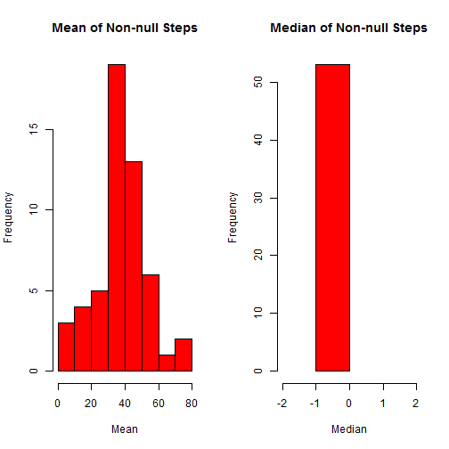
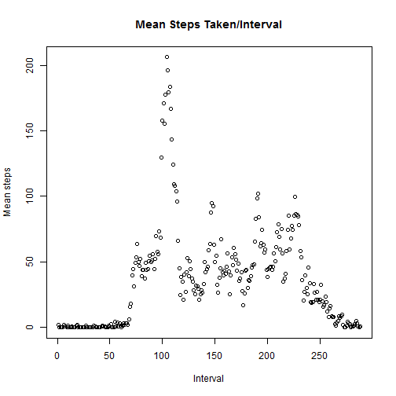
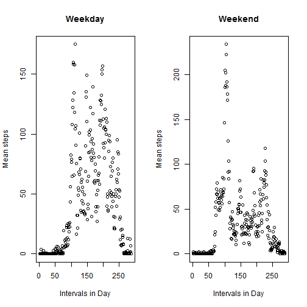

This document details an investigation into the exercise patterns of a device-wearing volunteer.

Step 1:  set up: the "activity.csv" file must be loaded in working directory in order for this to function, and the dplyr package must be loaded.


```r
require(dplyr)
```

```
## Loading required package: dplyr
## 
## Attaching package: 'dplyr'
## 
## The following objects are masked from 'package:stats':
## 
##     filter, lag
## 
## The following objects are masked from 'package:base':
## 
##     intersect, setdiff, setequal, union
```

```r
activity<- read.csv("activity.csv")
activity$interval<-as.factor(activity$interval)
```

Step 2a):  Calculate the total steps taken per day

```r
by_date <- group_by(activity, date)
activitydaysum <- summarise(by_date, count = n(), stepsum = sum(steps, na.rm = TRUE), stepmean = mean(steps, na.rm = TRUE), stepmedian = median(steps, na.rm = TRUE))
activitydaysum
```

```
## Source: local data frame [61 x 5]
## 
##          date count stepsum stepmean stepmedian
## 1  2012-10-01   288       0      NaN         NA
## 2  2012-10-02   288     126  0.43750          0
## 3  2012-10-03   288   11352 39.41667          0
## 4  2012-10-04   288   12116 42.06944          0
## 5  2012-10-05   288   13294 46.15972          0
## 6  2012-10-06   288   15420 53.54167          0
## 7  2012-10-07   288   11015 38.24653          0
## 8  2012-10-08   288       0      NaN         NA
## 9  2012-10-09   288   12811 44.48264          0
## 10 2012-10-10   288    9900 34.37500          0
## ..        ...   ...     ...      ...        ...
```

Step 2b): create a histogram plot of the mean and median of the total number of steps taken each day

```r
par(mfrow = c(1, 2))
with(activitydaysum, {
  hist(stepmean, col="red", xlab = "Mean", main = "Mean of Non-null Steps")
  hist(stepmedian, col="red", xlab = "Median", xlim = c(-2, 2), main = "Median of Non-null Steps")
})
```

 
It is apparent from this plot that there are many intervals of complete inactivity, rendering the median almost useless.

Step 3a) Make a time series plot of 5-minute interval (on the x-axis) and avg number of steps taken, averaged across all days (on the y-axis)

```r
by_interval <- group_by(activity, interval)
activityintervalsum <- summarise(by_interval, count = n(), stepsum = sum(steps, na.rm = TRUE), stepmean = mean(steps, na.rm = TRUE), stepmax = max(steps, na.rm = TRUE))
par(mfrow = c(1, 1))
  plot(activityintervalsum$stepmean, xlab = "Interval", ylab = "Mean steps", main = "Mean Steps Taken/Interval")
```

 
```

3b) Calculate which 5-minute interval, on average across all days in the dataset, contains the maximum number of steps?

```r
activityintervalsum<-arrange(activityintervalsum, desc(stepmean))
slice(activityintervalsum, 1)
```

```
## Source: local data frame [1 x 5]
## 
##   interval count stepsum stepmean stepmax
## 1      835    61   10927 206.1698     786
```

4a) Calculate and report the total number of missing values in the dataset

```r
sum(is.na(activity$steps))
```

```
## [1] 2304
```

4b) Explain strategy for imputing missing values:  time-of-day and day-of-week effects seem highly pronounced, so the strategy was to replace nulls with the mean for each null value's weekday and time.

4c) Create new dataframe using this strategy to fill in missing values.

```r
activityfilled <- activity #1) create data frame to fill with imputed step values
activityfilled <- within(activityfilled, date <- as.POSIXct(paste(date))) #2) change date to POXIXct format 
activityfilled <- within(activityfilled, weekday <- weekdays(as.Date(date))) #3) add a day of week variable
activityfilled <- within(activityfilled, weekend <- "weekday") #4) add a weekday/weekend variable, defaulted to weekday
activityfilled$weekend[activityfilled$weekday == "Saturday"] <- "weekend" #5) overwrite "weekend" for Saturdays
activityfilled$weekend[activityfilled$weekday == "Sunday"] <- "weekend" #6) overwrite "weekend" for Sundays
activityfilled <- within(activityfilled, stepsfilled <- steps) #7) fill steps values into the "stepsfilled" column
by_day_interval <- group_by(activityfilled, weekday, interval) #8) create filler table:  group by weekday and interval
filler <- summarise(by_day_interval, stepsfill = mean(steps, na.rm = TRUE)) #9) create filler table:  add mean(steps) by weekday and interval
activityfilled <- inner_join(activityfilled, filler, b = c("weekday","interval")) #10) join data frames
activityfilled$stepsfilled[is.na(activityfilled$stepsfilled)] <- activityfilled$stepsfill[is.na(activityfilled$stepsfilled)] #11) write weekday+interval mean values over nulls
```

4d) Calculate/report the mean and median total steps taken each day.  Calculate/report difference vs. unimputed values

```r
by_date_new <- group_by(activityfilled, date)
activitydaysumnew <- summarise(by_date_new, count = n(), stepsum = sum(stepsfilled, na.rm = TRUE), stepmean = mean(stepsfilled, na.rm = TRUE), stepmedian = median(stepsfilled, na.rm = TRUE))
activitydaysumnew
```

```
## Source: local data frame [61 x 5]
## 
##          date count   stepsum stepmean stepmedian
## 1  2012-10-01   288  9974.857 34.63492   8.214286
## 2  2012-10-02   288   126.000  0.43750   0.000000
## 3  2012-10-03   288 11352.000 39.41667   0.000000
## 4  2012-10-04   288 12116.000 42.06944   0.000000
## 5  2012-10-05   288 13294.000 46.15972   0.000000
## 6  2012-10-06   288 15420.000 53.54167   0.000000
## 7  2012-10-07   288 11015.000 38.24653   0.000000
## 8  2012-10-08   288  9974.857 34.63492   8.214286
## 9  2012-10-09   288 12811.000 44.48264   0.000000
## 10 2012-10-10   288  9900.000 34.37500   0.000000
## ..        ...   ...       ...      ...        ...
```

4e) Plot histogram of steps taken each day

```r
par(mfrow = c(1, 2))
with(activitydaysumnew, {
  hist(stepmean, col="red", xlab = "Mean", main = "Mean of Non-null Steps")
  hist(stepmedian, col="red", xlab = "Median", xlim = c(-2, 2), main = "Median of Non-null Steps")
})
```

 

5a) Add a weekend/weekday factor variable to imputed data set (done upstream).

5b) Make a panel plot of time series (type = 1) plot with 5-minute interval on X-axis, avg. steps per weekend/weekday day on y.

```r
weekend<-filter(activityfilled, weekend == "weekend")
weekday<-filter(activityfilled, weekend == "weekday")
by_interval_weekend <- group_by(weekend, interval, weekend)
activityintervalsumday <- summarise(by_interval_weekend, count = n(), stepsum = sum(steps, na.rm = TRUE), stepmean = mean(steps, na.rm = TRUE), stepmax = max(steps, na.rm = TRUE))
by_interval_weekday <- group_by(weekday, interval, weekend)
activityintervalsumend <- summarise(by_interval_weekday, count = n(), stepsum = sum(steps, na.rm = TRUE), stepmean = mean(steps, na.rm = TRUE), stepmax = max(steps, na.rm = TRUE))
par(mfrow = c(1, 2))
  plot(activityintervalsumday$stepmean, xlab = "Intervals in Day", ylab = "Mean steps", main = "Weekday")
  plot(activityintervalsumend$stepmean, xlab = "Intervals in Day", ylab = "Mean steps", main = "Weekend")
```

 

